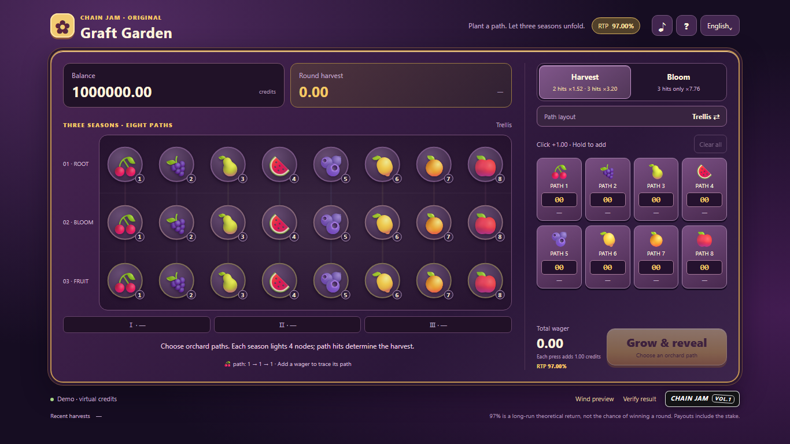

# Graft Garden

**English** | [简体中文](README.zh-CN.md)

**[Play the live demo](https://graft-garden.vercel.app/)** · [Source code](https://github.com/LuckyYouStudio/graft-garden)

Graft Garden is an original wagering game built for Chain Jam: eight fruit paths grow through three seasons of independent winds. Allocate your bets, choose a payout mode and a path layout, then watch the orchard light up and reveal your harvest. Both modes, both layouts, and every valid bet allocation have a **97% theoretical return to player (RTP)**.



- English, German, Spanish, Russian, Portuguese, Vietnamese and Chinese interfaces, with desktop and mobile layouts.
- A two-column orchard and control panel on desktop, and a compact single column on phones. Main controls stay visible on common screens; very small screens and short landscape viewports can scroll. The simulator view adapts to the host's available height.
- Eight betting lanes start at zero. Press and hold to add bets, clear all bets, or collect a completed harvest.
- Trellis and Graft layouts change how paths hit together. Harvest and Bloom modes offer different payout distributions.
- Includes a Chain casino SDK contract, Penpal bridge, game manifest, and Jam widget.
- Runs as a standalone static demo. When embedded in the official simulator, the game uses authoritative settlement results from the host and contract.

## Interface languages

The game supports English (`en`), Deutsch (`de`), Español (`es`), Русский (`ru`), Português (`pt`), Tiếng Việt (`vi`) and 中文 (`zh`). It remembers an explicit language choice, otherwise uses a supported browser language; an embedded host can supply the initial locale. Controls, rules, result messages, common errors and manifest metadata are translated. Changing language preserves wagers and the current harvest; payouts and token amounts use the same exact number format throughout.

Translation sources are in `fruit-machine-ui/locales/*.json`. After editing them, run `python scripts/build-locales.py` from the repository root to check key/placeholder completeness and regenerate the committed `i18n.js` browser bundle. `node scripts/graft-locales.test.cjs` checks all seven languages, persistence, keyboard navigation and desktop/mobile layouts (requires Playwright and the local game server).

## Quick start

Python 3 is required for the development server. SDK testing also requires Node.js and npm. Start the frontend from the repository root:

```sh
python scripts/serve-game.py
```

Open the [local demo](http://localhost:4199/). The frontend needs no build step, and standalone play uses a simulated balance. The development server includes the CORS headers needed for the simulator to read the game manifest.

The balance is labeled **Balance / 余额** in both modes. Standalone play starts with **1,000,000 virtual credits**, following the SDK simulator's test allocation; Chain Jam does not mandate a specific demo balance. SDK mode displays the host's `balances.smartVaultBalance` and never initializes or resets that balance in the frontend.

Start the bundled SDK in a second terminal:

```sh
cd casino-sdk/casino-sdk
npm ci
npm start
```

Open the [official local simulator](http://localhost:3300/), select `GraftGardenGame`, and set the game URL to `http://localhost:4199/`. Keep both services running. The startup process generates local contract addresses and records them in `simulator/local-node/deployed.json`.

**The local simulator uses test tokens. A successful local session is not a production-chain deployment or a listing on Chain.** The public Vercel URL is a hosted demo. See the [frontend and SDK guide](fruit-machine-ui/README.md) for more integration details (Chinese).

## How to play

1. Choose **Harvest** or **Bloom**, then choose the **Trellis** or **Graft** path layout.
2. Add a stake to one or more of the eight fruit paths. Hold a fruit button to keep adding bets.
3. Start the harvest. Each season's independent wind lights four consecutive nodes on an eight-node ring; each path passes through one node per season.
4. A path's total hits across all three seasons determine its payout using the table below.

The layout changes which nodes each path visits and how different paths win together. It does not change any individual path's expected return.

## Paytable and 97% RTP

A path has a `1/2` chance to hit in each independent season. Its total hit count therefore follows a binomial distribution:

| Hits across three seasons | Probability | Harvest payout | Bloom payout |
| --- | ---: | ---: | ---: |
| 0 | 1/8 | 0 | 0 |
| 1 | 3/8 | 0 | 0 |
| 2 | 3/8 | 1.52× | 0 |
| 3 | 1/8 | 3.20× | 7.76× |

Multipliers are the **total amount returned on that path's stake, including the stake**:

```text
Harvest RTP = 3/8 × 1.52 + 1/8 × 3.20 = 97%
Bloom RTP   = 1/8 × 7.76              = 97%
```

Since every path has the same expected return, any valid combination of stakes also has a 97% theoretical RTP. The contract requires each stake to be a multiple of `25` token base units so that payout calculations remain exact. RTP is a long-run theoretical average, not the probability of winning an individual round.

The independent reference model enumerates all `8³ = 512` wind combinations and checks the expected return, payout caps, and hit distributions. Its paytable matches the frontend engine and Solidity contract.

## Project structure

| Path | Purpose |
| --- | --- |
| [fruit-machine-ui/](fruit-machine-ui/) | Static interface, three-season animation, sound, localization, and standalone demo |
| [graft-engine.js](fruit-machine-ui/graft-engine.js) | Path model and exact paytable |
| [sdk-bridge.js](fruit-machine-ui/sdk-bridge.js) | Guest/host bridge, ABI encoding and decoding, and session recovery |
| [game.manifest.json](fruit-machine-ui/game.manifest.json) | Chain SDK game manifest |
| [GraftGardenGame.sol](casino-sdk/casino-sdk/simulator/contracts/GraftGardenGame.sol) | `ICasinoGameV2` contract, risk quotes, and randomness settlement |
| [casino-sdk/casino-sdk/](casino-sdk/casino-sdk/) | SDK, local chain, VRF network, and simulator |
| [scripts/](scripts/) | Development server, mathematical enumeration, and verification scripts |
| [reference-analysis/](reference-analysis/) | Verification reports and interface screenshots |
| [JAM_SUBMISSION.md](JAM_SUBMISSION.md) | Jam pitch, mathematical notes, and submission steps |

The directory name `fruit-machine-ui` comes from an earlier prototype. `FruitTigerGame.sol`, `engine.js`, and the old fruit-machine design materials are historical references and do not define the current Graft Garden paytable.

## Chain casino SDK integration

- **Contract:** `GraftGardenGame.sol` implements `ICasinoGameV2`, validates wagers, quotes risk and payout caps, and settles outcomes from supplied randomness.
- **Bridge:** The Penpal guest connects to the host, opens sessions, receives authoritative results, and reveals the outcome after the game animation. It supports recovery of interrupted sessions and cancellation of stuck randomness.
- **Manifest:** `game.manifest.json` declares `GraftGardenGame`, English and Chinese locales, the full-iframe presentation, and supported capabilities.
- **Standalone mode:** The public demo works outside the Chain iframe with virtual credits. Host integration uses the host's balance and contract settlement instead.

Full-page refresh recovery preserves the original session ID and keeps betting disabled while the session is synchronizing. The simulator publishes historical logs only after they have been fully parsed, checks the game's manifest against the selected contract at startup, and persists only configurations applied with **Restart harness**. This prevents stale `FruitTigerGame` settings or partially synchronized history from being used for a new round.

These are local integration capabilities, not a claim of a production-chain deployment, external security audit, or acceptance by the Jam organizers.

## Verification

Run the mathematical, frontend-model, and bridge checks from the repository root:

```sh
node scripts/graft-math.cjs
node scripts/graft-engine.test.cjs
node fruit-machine-ui/sdk-bridge.test.cjs
node fruit-machine-ui/audio.test.cjs
node --check fruit-machine-ui/app.js
npm --prefix casino-sdk/casino-sdk/simulator run compile-contracts
```

With the local SDK stack running, verify contract results and local on-chain sessions:

```sh
cd casino-sdk/casino-sdk/simulator
node scripts/verify-graft.mjs
```

Saved results are available in the [contract verification report](reference-analysis/GRAFT_CONTRACT_VERIFICATION.json) and [browser integration report](reference-analysis/GRAFT_BROWSER_VERIFICATION.json). These reports document local checks; they are not production deployment records or organizer approval.

Browser checks require Playwright. Keep the frontend and SDK services running, then execute these commands from the repository root:

```sh
npm install --no-save --package-lock=false playwright
npx playwright install chromium
node scripts/graft-browser.test.cjs
node scripts/graft-layout.test.cjs
node scripts/graft-refresh.test.cjs
```

You can set `PLAYWRIGHT_MODULE` and `CHROMIUM_PATH` to use an existing installation. The repository includes the SDK's public local test accounts. Local deployment state, runtime logs, dependencies, and environment files are excluded from version control.

Set `CHECK_SIMULATOR=1` to include the official simulator iframe in layout checks. Set `GAME_URL` to test a different frontend, including `https://graft-garden.vercel.app/`. Layout checks cover English and Chinese viewport sizes, long monetary values in history, touch targets, and visible controls; see the [layout verification report](reference-analysis/GRAFT_LAYOUT_VERIFICATION.json).

The refresh regression suite covers a full simulator-page reload during a round, recovery of that round, playing the next round, stale contract settings, and configuration changes that have not been applied. It uses separate local test accounts. With `GAME_URL=https://graft-garden.vercel.app/`, the same local-chain checks exercise the hosted frontend.

## Vercel deployment

The frontend is entirely static. When importing this repository into Vercel, set **Root Directory** to `fruit-machine-ui` and **Framework Preset** to **Other**. The directory's `vercel.json` skips installation and building, publishes the static files directly, and permits cross-origin access to the game manifest.

The production project is connected to this GitHub repository. New commits to `main` automatically deploy to [graft-garden.vercel.app](https://graft-garden.vercel.app/).

To deploy manually with the CLI, log in and link the existing project from the repository root:

```sh
npx vercel link --yes --scope luck-you --project graft-garden
npx vercel deploy --prod --yes --scope luck-you
```

The `luck-you` scope and `graft-garden` project identify this deployment; use your own scope and project when deploying a fork. Local `.vercel` connection details are not committed to Git.

For other static hosts, upload the entire `fruit-machine-ui` directory and preserve the manifest's CORS headers and iframe embedding support. The repository includes `_headers` and `vercel.json` examples.

After deploying, use a browser that is not signed into Vercel to check standalone play, the Jam widget, `/game.manifest.json`, and iframe embedding. See the [deployment verification report](reference-analysis/GRAFT_DEPLOYMENT_VERIFICATION.json) for recorded checks. The public URL runs the standalone demo unless it is embedded by a Chain host for SDK settlement.

## Chain Jam submission

- **Game title:** Graft Garden
- **Game URL:** [https://graft-garden.vercel.app/](https://graft-garden.vercel.app/)
- **Declared RTP:** 97%
- **Source access:** [LuckyYouStudio/graft-garden](https://github.com/LuckyYouStudio/graft-garden)
- **Pitch:** Wager on fruit paths across three seasons, then watch independent winds light up the orchard to reveal your harvest. Choose Trellis or Graft layouts and Harvest or Bloom payout modes, all with a mathematically verified 97% theoretical RTP.

The game includes the required Jam widget. See the [submission notes](JAM_SUBMISSION.md) for the remaining submission fields and the [official Chain Jam page](https://jam.chain.wtf/#submit) for the event's requirements. Submission status and eligibility are determined by the organizers.
