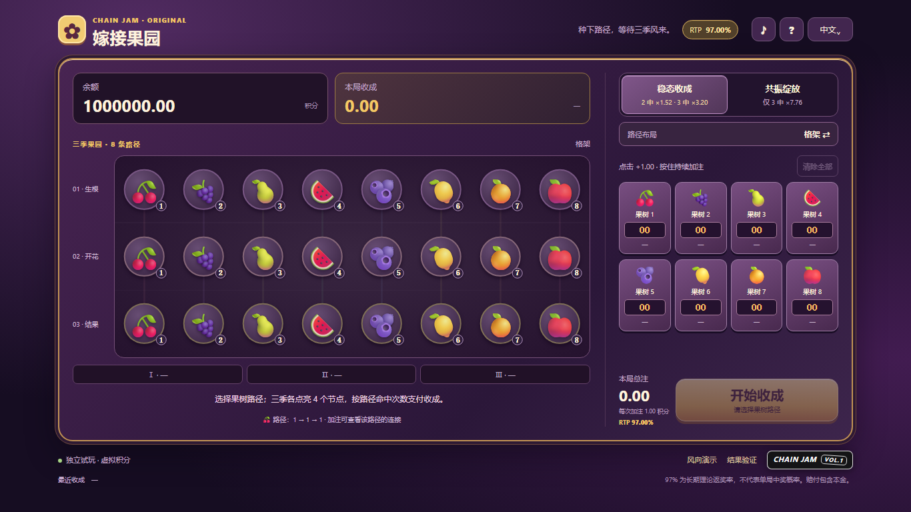

# Graft Garden · 嫁接果园

[English](README.md) | **简体中文**

**[在线试玩 · Play now](https://graft-garden.vercel.app)**

三季风向、八条果树路径的原创下注游戏，为 Chain Jam 制作。玩家分配路径下注，选择收成模式与嫁接布局，再观察三季节点依次点亮并结算。两种模式、两种布局及任意合法下注组合的理论 **RTP 均为 97%**。



- 中文 / English 界面，支持桌面和手机。
- 桌面使用果园与操作区双栏，手机使用紧凑单列；常见屏幕主要信息首屏可见，极小屏和矮横屏可滚动。模拟器中按宿主可用高度布局。
- 八路下注默认零；支持长按加注、清除下注及收取奖励。
- 格架 / 嫁接布局改变路径之间的关联；稳态收成 / 共振绽放提供不同返还分布。
- 包含 Chain casino SDK 合约、Penpal 桥接、游戏清单及 Jam widget。
- 静态页面可独立试玩；在官方模拟器中嵌入时使用 Host 与合约的权威结算结果。

## 快速开始

需要 Python 3；SDK 联调还需 Node.js 与 npm。先在仓库根目录启动前端：

```sh
python scripts/serve-game.py
```

打开 [本地试玩](http://localhost:4199/)。前端无需构建，独立试玩使用模拟余额。开发服务器已配置模拟器读取清单所需的 CORS 响应头。

页面统一使用「余额 / Balance」。独立试玩初始提供 1,000,000 虚拟积分，参考官方 SDK 模拟器的测试额度；Jam 规则本身没有指定试玩余额数字。SDK 模式只显示主机提供的 `balances.smartVaultBalance`，不会由前端初始化或重置。

另开终端启动仓库内的 SDK：

```sh
cd casino-sdk/casino-sdk
npm ci
npm start
```

打开 [官方本地模拟器](http://localhost:3300/)，在设置中选择 `GraftGardenGame`，游戏 URL 填写 `http://localhost:4199/`，并保持两个服务运行。本地链的部署地址由启动流程生成，记录于 `simulator/local-node/deployed.json`。

**本地模拟器使用测试代币，不代表正式链部署、公开托管或 Chain 平台上架。** 详细接入说明见 [前端与 SDK 文档](fruit-machine-ui/README.md)。

## 玩法与返奖率

每季随机点亮八个节点中的连续四个，每条路径在该季经过一个节点。三季风向独立，所以单路径每季的命中概率均为 `1/2`。最终按累计命中数返还：

| 三季命中数 | 概率 | 稳态收成 · Harvest | 共振绽放 · Bloom |
| --- | ---: | ---: | ---: |
| 0 | 1/8 | 0 | 0 |
| 1 | 3/8 | 0 | 0 |
| 2 | 3/8 | 1.52× | 0 |
| 3 | 1/8 | 3.20× | 7.76× |

倍率是对应路径下注的**总返还，包含本金**：

```text
Harvest RTP = 3/8 × 1.52 + 1/8 × 3.20 = 97%
Bloom RTP   = 1/8 × 7.76              = 97%
```

布局改变多路径的共同命中情况，不改变每条路径的期望。合约要求每条下注为 `25` 个 token 最小单位的整数倍，以保证返还精确。RTP 是理论平均返还比例，不是单局中奖率。

## 项目结构

| 路径 | 内容 |
| --- | --- |
| [fruit-machine-ui/](fruit-machine-ui/) | 静态界面、三季动画、音效、双语与独立试玩 |
| [graft-engine.js](fruit-machine-ui/graft-engine.js) | 路径模型与精确奖表 |
| [sdk-bridge.js](fruit-machine-ui/sdk-bridge.js) | Guest / Host 桥接、ABI 编解码及会话恢复 |
| [game.manifest.json](fruit-machine-ui/game.manifest.json) | Chain SDK 游戏清单 |
| [GraftGardenGame.sol](casino-sdk/casino-sdk/simulator/contracts/GraftGardenGame.sol) | `ICasinoGameV2` 合约、风险报价与随机数结算 |
| [casino-sdk/casino-sdk/](casino-sdk/casino-sdk/) | SDK、本地链、VRF 网络及模拟器 |
| [scripts/](scripts/) | 开发服务器、数学枚举与验证脚本 |
| [reference-analysis/](reference-analysis/) | 验证报告及界面截图 |
| [JAM_SUBMISSION.md](JAM_SUBMISSION.md) | 参赛提案、数学说明与提交步骤 |

目录名 `fruit-machine-ui` 沿用早期原型。旧 `FruitTigerGame.sol`、`engine.js` 和水果机设计资料仅为历史参考，不属于当前 Graft Garden 的奖表。

## 验证

在仓库根目录运行数学、前端模型及桥接检查：

```sh
node scripts/graft-math.cjs
node scripts/graft-engine.test.cjs
node fruit-machine-ui/sdk-bridge.test.cjs
node fruit-machine-ui/audio.test.cjs
node --check fruit-machine-ui/app.js
npm --prefix casino-sdk/casino-sdk/simulator run compile-contracts
```

保持 SDK 本地栈运行后，可验证合约结果和真实本地会话：

```sh
cd casino-sdk/casino-sdk/simulator
node scripts/verify-graft.mjs
```

数学模型枚举全部 `8³ = 512` 种风向组合。已有本地验证记录见 [合约报告](reference-analysis/GRAFT_CONTRACT_VERIFICATION.json) 和 [浏览器联调报告](reference-analysis/GRAFT_BROWSER_VERIFICATION.json)；这些报告不代表生产部署或主办方审核。

浏览器检查需要 Playwright。保持前端和 SDK 服务运行，在仓库根目录执行：

```sh
npm install --no-save --package-lock=false playwright
npx playwright install chromium
node scripts/graft-browser.test.cjs
node scripts/graft-layout.test.cjs
node scripts/graft-refresh.test.cjs
```

也可设置 `PLAYWRIGHT_MODULE` 与 `CHROMIUM_PATH` 使用已有安装。仓库保留 SDK 自带的公开本地测试账户；本地部署文件、运行日志、依赖目录与环境变量文件不进入版本控制。

布局检查可通过 `CHECK_SIMULATOR=1` 加入官方模拟器 iframe 场景，`GAME_URL` 可指定公开试玩地址。检查覆盖中英文屏幕尺寸、长金额历史记录、按钮点击区域与可视范围；记录见 [布局验证报告](reference-analysis/GRAFT_LAYOUT_VERIFICATION.json)。

刷新回归覆盖整个模拟器页面刷新后恢复原局、继续下一局、旧合约缓存与未应用配置。模拟器只保存已点击 Restart 的配置；启动时会检查页面清单与合约是否匹配。历史日志完整解析后才发布，页面恢复时锁定原会话编号，等待同步期间保持下注禁用。设置 `GAME_URL=https://graft-garden.vercel.app/` 可对线上前端执行同一套本地链测试。回归测试使用独立的本地测试账户。

公开托管时上传整个 `fruit-machine-ui` 目录，并保留清单的 CORS 响应头与 iframe 嵌入能力。项目附带 `_headers` 和 `vercel.json` 配置。参赛材料及外部步骤见 [Chain Jam 提交说明](JAM_SUBMISSION.md)，官方要求见 [Chain Jam](https://jam.chain.wtf/#submit)。

## Vercel 部署

在 Vercel 导入此仓库时，将 **Root Directory** 设为 `fruit-machine-ui`，框架选择 **Other**。该目录中的 `vercel.json` 已设置跳过安装和构建、直接发布静态文件，并允许主机跨域读取游戏清单。

生产项目已连接此 GitHub 仓库，`main` 分支的新提交会自动发布到上方试玩地址；项目根目录为 `fruit-machine-ui`。

如需通过 CLI 手动发布，在完成登录后从仓库根目录链接现有项目：

```sh
npx vercel link --yes --scope luck-you --project graft-garden
npx vercel deploy --prod --yes --scope luck-you
```

报名使用公开的生产域名。部署后应在未登录 Vercel 的浏览器中检查试玩、Jam 标识、`/game.manifest.json` 及 iframe 嵌入；本地 `.vercel` 连接信息不会提交到 Git。

公开试玩的检查记录见 [部署验证报告](reference-analysis/GRAFT_DEPLOYMENT_VERIFICATION.json)。该网址运行独立试玩；通过 Chain 主机嵌入后使用 SDK 结算。
